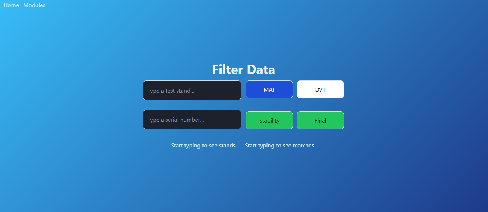
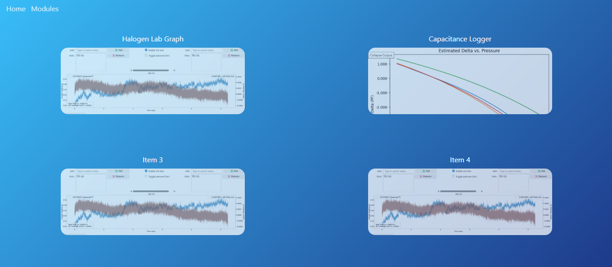
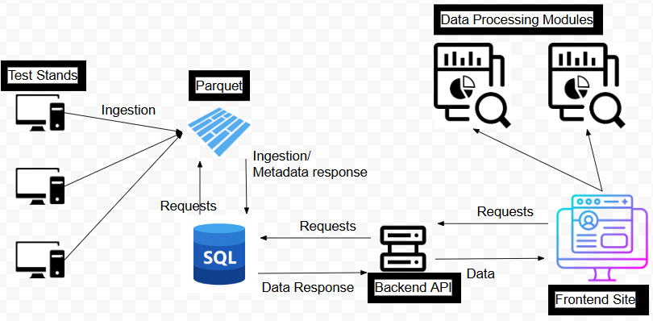
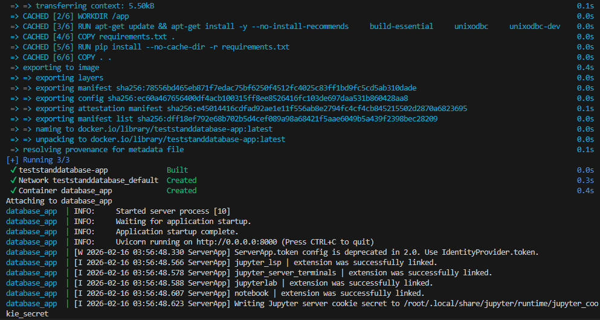
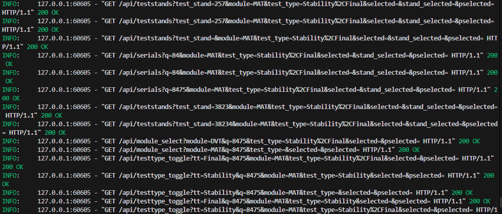

# MKS_Database_Tool_Filtered

Old test data frequently kept getting lost or was unable to answer critical customer questions, meaning engineers frequently had to redo old tests or manually search thousands of excel folders for the right files. Additionally, there was no central service for data processing modules, so engineers had to create their tools to analyze specific types of data. These could be in any language (Python, MATLAB, Excel, etc.) and could not be used on other machines. 
To solve this, I created a central database to contain the data from all test stands and a Python Application to let users fetch data and host their own modules. I was given a general goal and guided by senior engineers that wanted this project for a long time, but the majority of design decisions were mine and I wrote every line of code (with some help from AI).

Centralized Excel data from distributed machines into a central database organized by SQL and Parquet.
A Python FastHTML API and UI allows users to filter the data and access hosted data processing modules.
Database and Applications (UI + API) sides are stored on two seperate servers. A docker container hosts the web interface and allows the applications side to access the database.

 - Compressed 3TB+ of Excel Data for ~20 users
 - Two types: MAT and DVT data. Implemented MAT first as proof-of-concept.
 - Administrator can manually ingest select test stands.
 - Python watchdog uses polling to monitor directories and upload changes to staging_dir. A seperate system (not fully implemented by end of co-op) automatically ingests the staging_dir to the database.

The main page allows for filtering between different data types, test types, test stands, and units. It will automatically display valid matches in columns below, but this will not be shown here for security.

The modules page allows for accessing data processing modules, usually jupyter or marimo notebooks. The idea is that people can build their own data analysis tools and host them on the server for other people to use. The current modules available are ones that I built for different analysis tools. These were also long-term projects themselves. All the tools will be hosted on the applications server to avoid fixing issues on a machine-by-machine basis. Eventually, the goal is to set a pipeline directly from the database server into individual data modules.

 - Two-tier parquet system: Bronze and Silver. A silver parquet file represents a serial number folder. A bronze parquet file represents an excel file. A silver parquet file contains a list of bronze file paths and unit-level data. I chose this design because a typical query is done by serial number, and this allows the user to only access the files of a certain serial number or get unit-level metadata without accessing the bronze parquet files; this is the most efficient system in most cases.
 - Read SQL, not Parquet files. Traversing a SQL database is very fast compared to opening and reading thousands of parquet files. When filtering data, we want to access the SQL database whenever possible. This means the SQL database also contains metadata ingested from the parquet files. During testing, this change significantly improved query time with lots of data. 
 - LRU Cache for repeated serial number queries.
 - Ingestion process: Test stand -> parquet; program reads excel files to determine metadata, parquet -> SQL (dbo.Bronze, dbo.Silver). Python watchdog automates subsequent data ingestion from test stands. Most importantly, the process is IDEMPOTENT, meaning multiple ingestion commands have the same result. This by itself eliminates most data ingestion errors.
 - Docker container coordinates UI, database, and data processing modules.

FUTURE ROADMAP
 - Support for DVT data.
 - Complete ingestion automation: determine how to safely ingest in the middle of tests.
 - Add support for pdfs and pngs.
 - Refine data-querying method to support more sophisticated metadata handling. This might help us answer questions without reading the bronze files at all; we could also tailor metadata for common questions.
